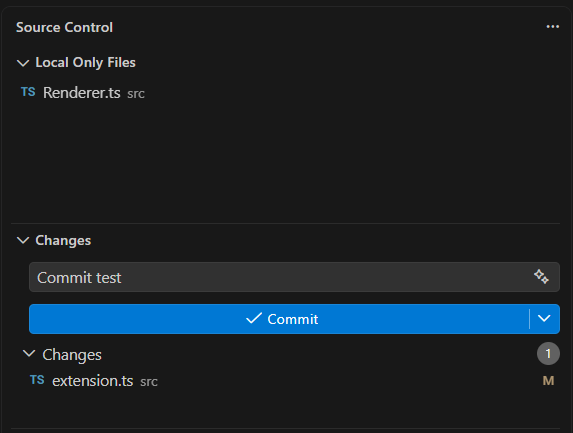
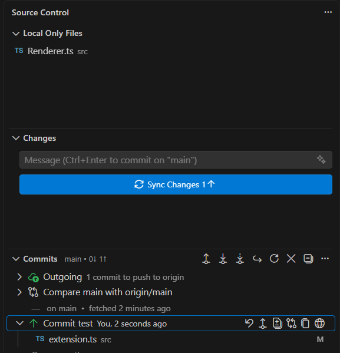

# Git Local Only

A VS Code extension that introduces a new SCM resource group named "Local Only Files" for tracked files that should remain modified locally but never participate in staging or commit workflows.

## The Problem

Developers frequently maintain local modifications in tracked files that should never be committed (e.g., `.env` tweaks, local debug flags in code, or personalized config files). If they are tracked by Git, they constantly appear in the "Changes" view and can easily be accidentally committed. 

## The Solution

This extension provides a dedicated "Local Only Files" view in the Source Control panel. 

By right-clicking any file in the Explorer or Source Control view, you can **Add to Local Only**. This removes it from Git's radar, hiding it from the "Changes" tab so it can never be accidentally committed or staged.

### How it works

Behind the scenes, this extension leverages Git's native `--skip-worktree` flag (`git update-index --skip-worktree <file>`). This precisely matches the requirement: modifying tracked files without ever committing them. By using native Git flags, it guarantees these files are natively ignored by all Git clients (including the built-in VS Code Git extension).

## Usage

1. Right-click on a file in the VS Code Explorer or the Source Control "Changes" view.
2. Select **Add to Local Only**.
3. The file will disappear from your normal Git changes and move to the **Local Only Files** view inside the Source Control panel.
4. To restore normal Git tracking, right-click the file in the **Local Only Files** view and select **Remove from Local Only**.
